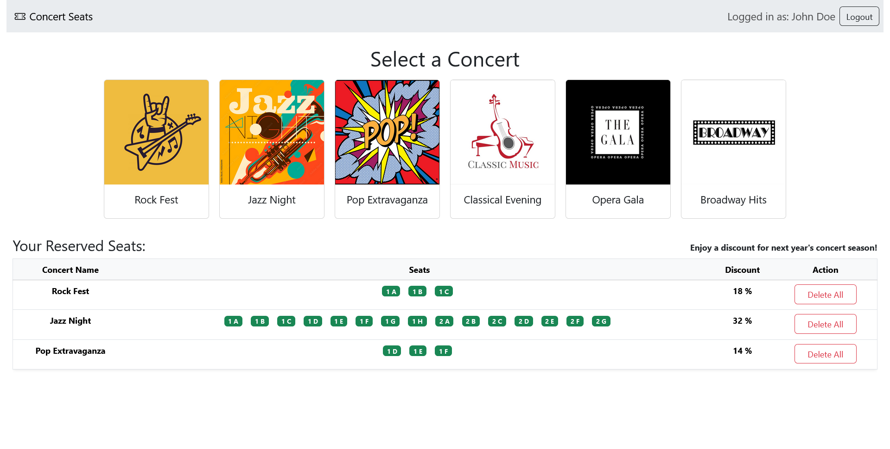
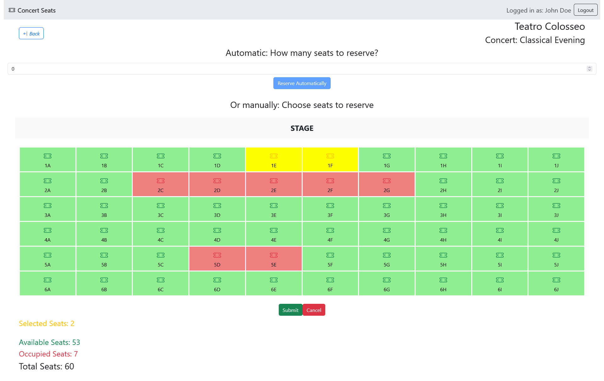

# "Concert Seats"
## Student: sXXXXXX 

## React Client Application Routes

- Route `/`: Home page, shows the list of all concerts. Logged in users can also see their reservations (with discount) and delete them.  
- Route `/login`: Login form, allows users to login. After a successful login, the user is redirected to the previous page (home page or theater page).  
- Route `/theater/:theaterId/:concertName`: Theater page, shows the theater grid with the occupied and available seats. Logged in user can also reserve some seats in two different ways, automatic and manual.  
- Route `*`: Page for nonexisting URLs (_Not Found_ page) that redirects to the main route ("/").

## API Server
* **GET `/api/concerts`**: Get all the concerts as a JSON list.
  - **Response body**: JSON object with the list of courses with the form {concert_id, concert_name, theater_id}, or description of the error(s)
  ```
    { id: 1, concert: "Rock Fest", theater: 1 }
    ```
  - Codes: `200 OK`, `503 Service Unavailable`

* **GET `/api/theaters/:theaterId`**: Returns the specifications of the theater with the requested theaterId
  - **Request parameter**: Id of the theater associated to the previously chosen concert 
  - **Response body**: JSON object with all the specifications for the requested theater {id, name, size, rows, columns, seats}, or description of the error(s)
  ```
    { id: 2, name: "Teatro Colosseo", size: "medium", rows: 6, columns: 10, seats: 60 }
    ```
  - Codes: `200 OK`, `422 Unprocessable Content`, `404 Not Found`, `503 Service Unavailable`

* **GET `/api/reservations/:concertId`**: Get all the occupied seats for the specified concert as a JSON list.
  - **Request parameter**: Id of the previously chosen concert
  - **Response body**: JSON object with the list of all the occupied seats for the requested concert, or description of the error(s)
  ```
    { [ 
      {reservation_id: 3, concert_id: 1, concert_name: "Rock Fest", row: 2, place: "E", user: 4},
      {reservation_id: 4, concert_id: 1, concert_name: "Rock Fest", row: 2, place: "F", user: 4},
      {reservation_id: 10, concert_id: 1, concert_name: "Rock Fest", row: 4, place: "A", user: 1},
      {....}
    ] }
    ```
  - Codes: `200 OK`, `422 Unprocessable Content`, `404 Not Found`, `503 Service Unavailable`

* **GET `/api/reservations/concert/:userId`**: Get all the seats reserved by a user as a JSON list.
  - **Request parameter**: Id of the logged in user
  - **Response body**: JSON object with the list of all the seats reserved by the user for all the concerts, or description of the error(s)
  ```
    { [
      {reservation_id: 3, concert_id: 1, concert_name: "Rock Fest", row: 2, place: "E", user: 4},
      {reservation_id: 4, concert_id: 1, concert_name: "Rock Fest", row: 2, place: "F", user: 4},
      {reservation_id: 20, concert_id: 2, concert_name: "Jazz Night", row: 4, place: "A", user: 4},
      {reservation_id: 21, concert_id: 2, concert_name: "Jazz Night", row: 4, place: "B", user: 4},
      {....}
    ] }
    ```
  - Codes: `200 OK`, `422 Unprocessable Content`, `401 Unauthorized`, `404 Not Found`, `503 Service Unavailable`

* **GET `/api/reservations/check-availability/:concertId/:row/:place`**: Controls if the seat given as parameter (row,place) has been already occupied for requested concert. It avoids requests conflict between two users that are booking the same seat simultaneously.
  - **Request parameter**: Id of the chosen concert, row and place (column) of the seat to check
  - **Response body**: JSON object like {row, place, isOccupied} or description of the error(s). The Boolean element isOccupied reports wheter the seat has been already occupied or not.
  ```
    { row: 1, place: "A", isOccupied: false}
    ```
  - Codes: `200 OK`, `422 Unprocessable Content`, `401 Unauthorized`, `503 Service Unavailable`

* **POST `/api/reservations`**: Create a new occupied seat in the reservations table in the database.
  - **Request body**: JSON object with all the specifications for the new occupied seat {concert_id, concert_name, row, place, user}
  ```
    { concert_id: 1, concert_name: "Rock Fest", row: 3, place: "A", user: 5 }
    ```
  - **Response body**:Success message with the number of seats inserted in the database.
  ```
    { "1 seats successfully added." }
    ```
  - Codes: `200 OK`, `401 Unauthorized`, `422 Unprocessable Content`, `503 Service Unavailable`

* **POST `/api/reservations/auto-reserve`**: Create a new occupied seat in the reservations table in the database, after choosing the first available seat (for the automatic reservation).
  - **Request body**: JSON object with all the specifications to choose an available seat and book it, { selectedConcert, seatCount, userId, theaterData }
  ```
    {  selectedConcert: { id: 1, name: 'Rock Fest', theater: 1 }, seatCount: 3, userId: 1, 
    theaterData: {id: 1, name: 'Teatro Gioiello', size: 'Small', rows: 4, columns: 8, seats: 32}
    }
    ```
  - **Response body**: JSON object with the list of the reserved seats {row, place}
  ```
    { [
      { row: 1, place: 'A' },
      { row: 1, place: 'B' },
      { row: 1, place: 'C' }
    ]  }
    ```
  - Codes: `200 OK`, `401 Unauthorized`, `422 Unprocessable Content`, `500 Internal Server Error`, `503 Service Unavailable`

* **DELETE `/api/reservations/:concertId`**: Delete the reservation of the logged in user for the requested concert (given its Id).
  - **Request parameter**: concertId for which the deletion is required.
  - **Response body**: JSON obejct with success message, or a description of the error.
  ```
    { message: "Reservation of the user 1 for the concert 1 successfully deleted." }
    ```
  - Codes: `200 OK`, `401 Unauthorized`, `422 Unprocessable Content`, `503 Service Unavailable`

* **GET `/api/auth-token`**: Returns an auth token the logged in user.
  - **Response body**: JSON object with token
  - **Token payload**: loyalty flag and userId 
  ```
    { access: req.user.loyalty, authId: req.user.id }
    ```
  - Codes: `200 OK`


### Authentication APIs
* **POST `/api/sessions`**: Authenticate and login the user.
  - **Request**: JSON object with _username_ equal to email:   
  ```
    { "username": "user1@exam.com", "password": "pwd" }
    ```
  - **Response body**: JSON object with the user's info or a description of the errors:   
  ```
    { "id": 1, "username": 'user1@exam.com', "name": 'John Doe', "loyalty": 1 }
    ```
  - Codes: `200 OK`, `401 Unauthorized` (incorrect email and/or password), `400 Bad Request` (invalid request body).

* **GET `/api/sessions/current`**: Get info on the logged in user.
  - Codes: `200 OK`, `401 Unauthorized`.
  - **Response body**: JSON object with the same info as in login:   
  ```
    { "id": 1, "username": 'user1@exam.com', "name": 'John Doe', "loyalty": 1 }
    ```

* **DELETE `/api/sessions/current`**: Logout the user.
  - **Response body**: Empty object if success.
  - Codes: `200 OK`.

## API Server2
* **POST `/api/discount`**: Returns the discount value given a list of rows reserved for a concert.
  - **Request**: JSON object with the array of all the rows reserved by the user for the concert:   
  ```
    { "rows": [1, 10, 10, 13] }
    ```
  - **Response body**: JSON object with the computed discount value.
  ```
    { 25 }
    ```
  - Codes: `200 OK`, `422 Unprocessable Content`.


## Database Tables

- Table `theaters`: autogenerated_id, name, size, rows, columns, total seats(=rows*columns) automatically updated with a trigger `update_seats_before_insert`
- Table `users`: autogenerated_id, email, name, hash, salt, loyalty(=0:false, 1:true).
- Table `concerts`: autogenerated_id, concert_name, theater_id.  
theater_id references theater id.
- Table `reservations`: autogenerated_id, concert_id, concert_name, row, place, user.  
A row in this table means that the specified seat (row,place) has been reserved by a user for a specific concert.  
concert_id, concert_name reference to id, concert_name in concerts table, the concert_id allows to reconstruct the number of available seats in the theater of the concert.

## Main React Components

- `AppWithRouter` (in `App.jsx`): takes the role of App and is rendered inside a Router to be able to use the useNavigate hook. It manages the main state and functionality of the application. It tracks the user's login status, selected concert, reserved seats, theater data, and handles reservations. It also manages API calls to fetch concert lists and reserved seats and handles user authentication, including login, logout, and token renewal. This is also responsible for the client-side deletion of the seats reserved by the user.  Through its routes, it renders different layouts for concerts, theaters, login, and error handling, while providing navigation between these views based on the user's actions.  
- `Generic Layout` (in `/components/Layouts.jsx`): provides a common structure for the app by rendering the navigation bar at the top and using an _Outlet_ to display nested components based on the current route.
- `ConcertsLayout` (in `/components/Layouts.jsx`): proper home page, contains the list of concerts and, when the user is logged in, it shows his/her reserved seats for each concert and the associated discount value. 
- `TheaterLayout` (in `/components/Layouts.jsx`): displays the theater layout for a selected concert (provided by _TheaterTable_ component), showing available and occupied seats. If the user is logged in, it allows seat reservation using the _Reservation_ component. It also manages the retrieval of theater data and occupied seats via API calls, and conditionally renders alerts and seat information based on the user's login status and reservation state.
- `TheaterTable` (in `/components/TheaterTable.jsx`): renders the seating chart for the theater, allowing logged-in users to select seats if they aren't already occupied. The table color-codes the seats (green for available, red for occupied, yellow for selected, blue for already reserved), and includes buttons for submitting or canceling reservations.
- `Reservation` (in `/components/Reservation.jsx`): offers both automatic and manual seat selection methods. It handles user actions for selecting seats, checking availability, and submitting or canceling reservations, providing feedback on the status of the booking process.
- `AutomaticReservation` (in `/components/Reservation.jsx`): allows users to automatically reserve a specified number of seats for a concert. It submits the seat request, handling success or failure by updating the reservation state and displaying appropriate messages.
- `ManualReservation` (in `/components/Reservation.jsx`): manages manual seat selection by displaying the seating chart (provided by _TheaterTable_ component). It checks seat availability, highlights already-occupied seats, and lets users confirm or cancel their reservation, with selected seats displayed in a modal for confirmation before submission. In case of errors if the selected seats can not be added, it updates the reservation state and displays the reason.
- `LoginForm` (in `/components/Auth.jsx`): the login form that users can use to login into the app. This is responsible for the client-side validation of the login credentials (valid email and non-empty password).


## Screenshots




## Users Credentials

- user1@exam.com, pwd
- user2@exam.com, pwd
- user3@exam.com, pwd
- user4@exam.com, pwd
- user5@exam.com, pwd
- user6@exam.com, pwd


